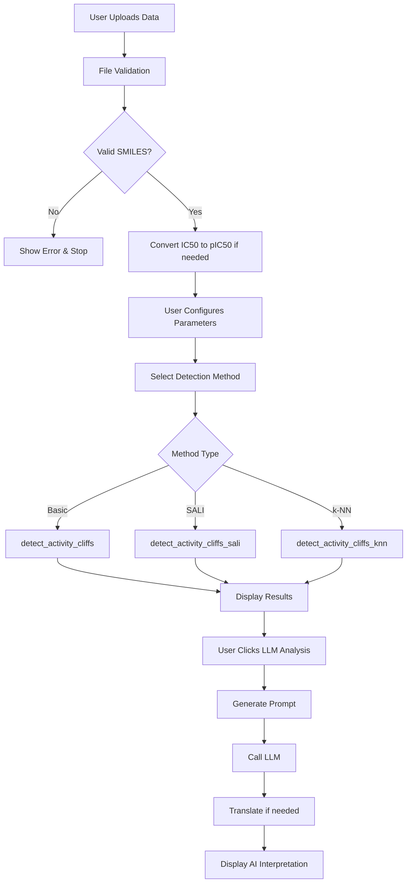
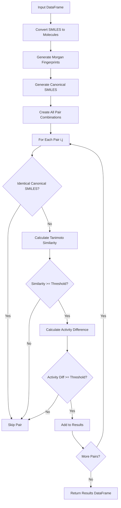
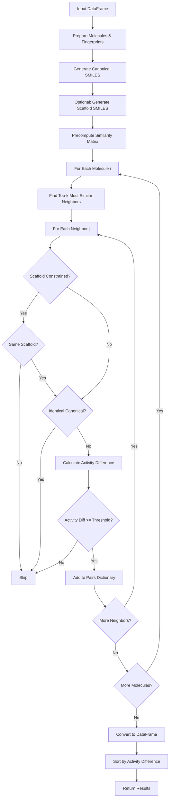
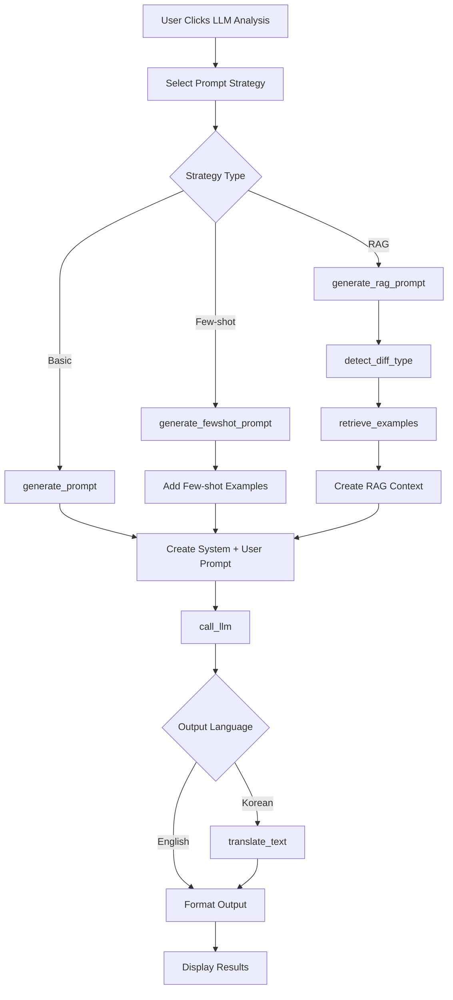
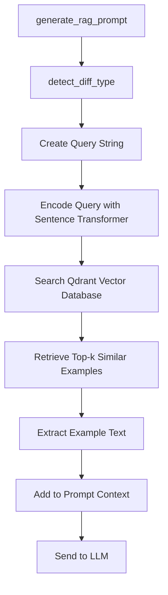
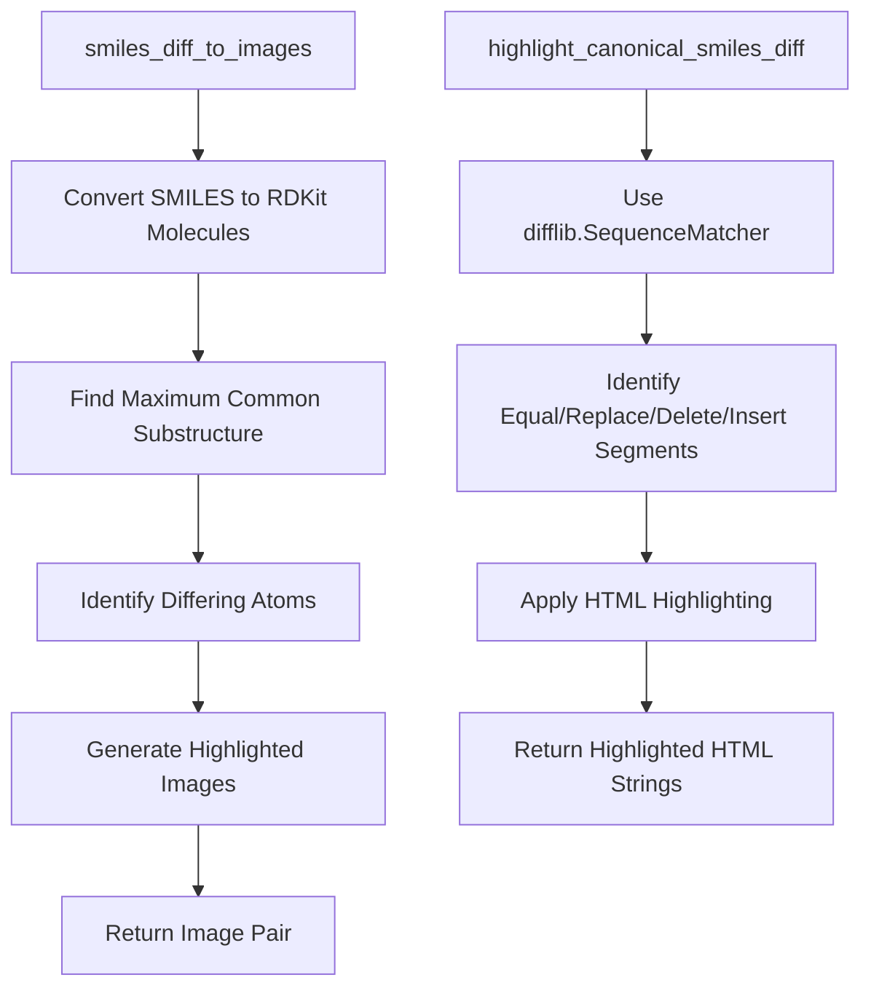
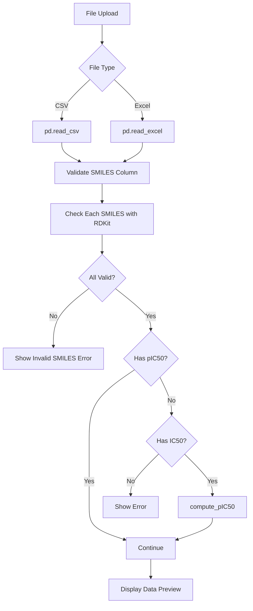
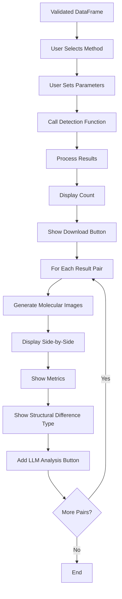

# Activity Cliff Analyzer - Major Function Flows

## 🔄 Main Application Flow



## 🧬 Core Detection Algorithm Flow

### Basic Threshold Detection (`detect_activity_cliffs`)



### SALI Ranking Detection (`detect_activity_cliffs_sali`)

```mermaid
graph TD
    A[Input DataFrame] --> B[Prepare Molecules & Fingerprints]
    B --> C[Generate Canonical SMILES]
    C --> D[Optional: Generate Scaffold SMILES]
    D --> E[For Each Pair i,j]
    E --> F{Identical Canonical?}
    F -->|Yes| G[Skip]
    F -->|No| H{Scaffold Constrained?}
    H -->|Yes| I{Same Scaffold?}
    I -->|No| G
    I -->|Yes| J[Calculate Similarity]
    H -->|No| J
    J --> K{Similarity >= Floor?}
    K -->|No| G
    K -->|Yes| L[Calculate Activity Difference]
    L --> M[Calculate SALI = ΔpIC50 / (1-similarity)]
    M --> N[Add to Candidate List]
    N --> O{More Pairs?}
    O -->|Yes| E
    O -->|No| P[Sort by SALI Descending]
    P --> Q[Take Top N Results]
    Q --> R[Return Results DataFrame]
```

### k-NN Based Detection (`detect_activity_cliffs_knn`)



## 🤖 AI Interpretation Flow

### LLM Integration Flow (`prompts.py`)



### RAG Retrieval Flow (`rag/retriever.py`)



## 🎨 Visualization Flow

### Molecular Visualization (`utils.py`)



## 🔧 Data Processing Flow

### File Processing (`app.py`)



### Activity Cliff Detection Pipeline



## 🔍 Key Function Signatures

### Core Detection Functions

```python
# Basic threshold detection
def detect_activity_cliffs(df, sim_thres=0.85, act_thres=1.0):
    """
    Input: DataFrame with SMILES, pIC50 columns
    Output: DataFrame with activity cliff pairs
    """

# SALI ranking detection  
def detect_activity_cliffs_sali(df, top_n=200, radius=2, fp_bits=2048, 
                               sim_floor=0.5, scaffold_constrained=False):
    """
    Input: DataFrame + SALI parameters
    Output: DataFrame ranked by SALI score
    """

# k-NN detection
def detect_activity_cliffs_knn(df, k=8, act_thres=1.0, radius=2, 
                              fp_bits=2048, min_sim=0.0, scaffold_constrained=False):
    """
    Input: DataFrame + k-NN parameters  
    Output: DataFrame with nearest neighbor cliffs
    """
```

### AI Integration Functions

```python
# Prompt generation
def generate_prompt(row):
    """Input: Activity cliff pair row, Output: (system_prompt, user_prompt)"""

def generate_fewshot_prompt(row):
    """Input: Activity cliff pair row, Output: Prompt with examples"""

def generate_rag_prompt(row, client):
    """Input: Activity cliff pair + Qdrant client, Output: RAG-enhanced prompt"""

# LLM calling
def call_llm(system_prompt, user_prompt):
    """Input: Prompts, Output: LLM response"""

def translate_text(text, target_language="Korean"):
    """Input: English text, Output: Translated text"""
```

### Utility Functions

```python
# Molecular processing
def compute_pIC50(ic50_nM):
    """Input: IC50 in nM, Output: pIC50 value"""

def smiles_diff_to_images(smiles1, smiles2, size=(300, 300)):
    """Input: Two SMILES, Output: Highlighted molecular images"""

def highlight_canonical_smiles_diff(a, b):
    """Input: Two canonical SMILES, Output: HTML-highlighted differences"""

# Structural analysis
def detect_diff_type(mol1, mol2):
    """Input: Two RDKit molecules, Output: Difference type classification"""
```

## 📊 Data Flow Summary

1. **Input**: CSV/Excel with SMILES + IC50/pIC50
2. **Validation**: SMILES validation, data conversion
3. **Detection**: One of three algorithms processes all pairs
4. **Results**: Structured DataFrame with cliff pairs
5. **Visualization**: Molecular images and highlighted differences
6. **AI Analysis**: On-demand LLM interpretation
7. **Output**: Downloadable results and AI insights

This flow ensures robust data processing, flexible detection strategies, and comprehensive analysis capabilities for activity cliff identification in drug discovery.

