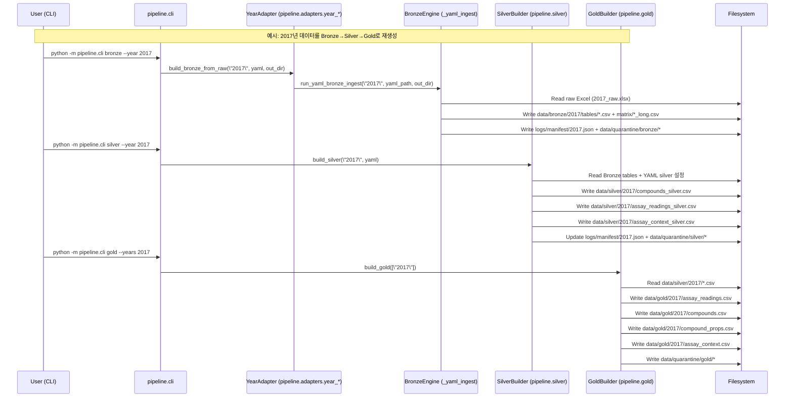

### Execution Flow: CLI → Bronze → Silver → Gold

#### 개요

이 문서는 연도별 특허 Excel에서 Gold 테이블까지 도달하는 실행 플로우를 시퀀스 다이어그램으로 정리합니다.

#### Medallion 파이프라인 시퀀스

#### 앱 레벨 데이터 플로우 (요약)

- `modules/io_utils.load_gold_data` 는 `data/gold/{year}/...`를 읽어 **SMILES + Activity** 스키마로 변환합니다.
- `app.py` 의 탭 1–2는 이 Gold 데이터를 사용해:
  - 연도/패널/타깃/세포주 선택
  - 구조-활성(Activity Cliff) 분석 및 히트맵 시각화를 수행합니다.
- 탭 3–6은 선택된 쌍과 Gold 메타데이터를 바탕으로 LLM API를 호출해:
  - 가설 생성 → 평가 → 수동/자동 수정 워크플로우를 제공합니다.

